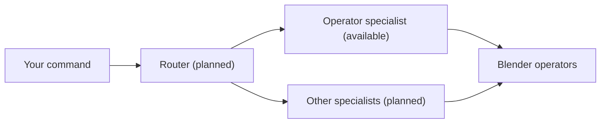

# Shilpi

Offline AI add-on for Blender, powered by small models fine-tuned for Blender.

> **Status: early development.** Only the operator model is available right now. It handles direct commands
> like selecting, moving, rotating and scaling objects, adding objects, modifiers and lights, and shading.
> Everything else is on the [roadmap](#roadmap).

## What it can do today

Type a command in plain English and the operator model turns it into Blender operators. For example:

- `pick the cube`
- `shift Table over to -1.3, 2.5, 0`
- `spin the cone 45 degrees on z`
- `resize the base to 1.5 times its default size`
- `throw in a monkey of size 3.2`
- `add a mirror modifier to the cone`
- `light it with a sun light at 1.6 -4 6`
- `make the sphere look smooth, not faceted`
- `drop in a cylinder and shade it smooth`
- `erase the cone from the scene`

It also asks which object you mean when two look alike ("Which one do you mean: Cube or Cube.001?"), declines
requests that aren't Blender commands, and every command can be undone with a single Ctrl+Z.

You can also say commands out loud instead of typing them. Speech recognition runs locally too.

## Why offline

- **Privacy:** your scenes and commands never leave your computer.
- **No subscription or API costs:** the model runs on your own hardware.
- **Works without internet:** after the one-time setup download, no connection is needed.

## How it works

Shilpi is designed as a small router model in front of several specialists. Each specialist is a LoRA adapter
on one shared local base model, so many specialists fit in normal RAM: only the small adapters differ.

Today the add-on sends every command straight to the operator model. Along with your command, it sends a short
description of the scene (objects, selection, mode). The model answers with a list of operator calls, which the
add-on checks against the operators it knows and runs in Blender.

The models are based on the Qwen family and fine-tuned with LoRA. The training data pairs natural-language
commands with `bpy` operations, and every pair was verified by running it in Blender.

## Benchmarks

Accuracy on our held-out test set: 196 commands the model never saw in training. Each answer is run in
Blender 5.2.1 and checked against the expected result.

| Model | Size | Held-out accuracy |
|---|---|---|
| **Shilpi operator model** (Qwen3.5 2B + LoRA) | 2B | **95.9%** |
| Qwen3.5 2B, not fine-tuned, same prompt | 2B | 4.6% |
| DeepSeek V4 Pro, same prompt | large, cloud | 12.8% |
| DeepSeek V4 Pro, same prompt plus argument names | large, cloud | 83.2% |

Test setup

- **Prompt.** Every model gets the same system prompt:

  > You are the Blender operator agent. Turn the request into Blender operator calls. Reply with JSON only:
  > {"calls": [{"op": "&lt;bpy.ops name&gt;", "args": {...}}]}. Use bai.select to select objects by name and
  > bai.set to set location, rotation_euler (radians), scale, name, hidden or hide_render.

  The user message is the compact scene description (objects, types, locations, selection, mode) followed by
  the command, in the same format the add-on sends.
- **Decoding.** Temperature 0, thinking off. The two local models run in llama.cpp (q8_0) with constrained
  decoding: a JSON schema of the 245 supported operators and their arguments, the same as the add-on uses.
  Without it the untuned Qwen3.5 2B scores 0% (none of its answers are valid); the fine-tuned model scores the
  same 95.9%. DeepSeek's API doesn't support custom schemas, so it uses JSON mode instead.
- **Fairness adjustments for DeepSeek.** A leading `bpy.ops.` in operator names is removed before grading (the
  prompt's wording allows it), and answers may be up to 1,024 tokens instead of 256.
- **"Plus argument names."** With the prompt alone, 158 of DeepSeek's 196 answers fail only because it writes
  `bai.select` with `{"name": ...}` instead of `{"objects": [...]}`. The last row adds one sentence to the
  prompt: *Argument names: bai.select {"objects": [object names], "active": name, "extend": true/false};
  bai.set {"object": name, "property": "location" | "rotation_euler" | "scale" | "name" | "hidden" |
  "hide_render", "value": ...}. Write operators without the "bpy.ops." prefix, for example {"op":
  "object.modifier_add", "args": {"type": "BEVEL"}}.*
- **Grading.** Each answer is run in headless Blender on the command's starting scene and checked against the
  expected result (for example the object's new location, or the added modifier), so a different answer that
  does the right thing also counts.
- **Scripts.** `scripts/eval_operator_agent.py` (test set: `evals/operator/heldout.jsonl`).

## Installation

You need Blender 5.2 or newer. The add-on supports Windows, macOS (Apple Silicon and Intel) and Linux.
<!-- TODO: confirm which platforms have been tested -->

1. Download `shilpi.zip` from the [Releases](../../releases) page. <!-- TODO: publish the first release -->
2. In Blender, open **Edit > Preferences > Get Extensions**, click the **⌄** menu in the top right, choose
   **Install from Disk**, and pick the zip.
3. In the 3D Viewport, press **N** and open the **Shilpi** tab.
4. Click **Set up**. The add-on uses llama.cpp if it is already installed, and otherwise downloads it (about
   30 MB). It then downloads the model weights (about 2.1 GB) from
   [Hugging Face](https://huggingface.co/Tushar98923/shilpi-operator-GGUF). A progress bar shows the download;
   if it is interrupted, clicking **Set up** again continues where it stopped.
   <!-- TODO: confirm the Hugging Face repository is public -->

**Manual model download:** download the `.gguf` file from Hugging Face yourself, then set **Model file** under
**Advanced** in the add-on's preferences. Setup then skips the download.

**Voice (optional):** click **Install voice** in the Shilpi tab. It installs the speech-recognition packages
and downloads a small Whisper model (about 230 MB together). Speech recognition runs on the CPU, so the GPU
stays free for the operator model.

## Hardware requirements

| | Approximate |
|---|---|
| Disk | about 2.2 GB (model and llama.cpp), plus about 230 MB for voice |
| GPU memory | about 2.5 GB <!-- TODO: confirm exact VRAM use --> |
| System RAM | <!-- TODO: add RAM figure --> |

A GPU is recommended (NVIDIA, AMD, Intel or Apple Silicon). The model also runs on the CPU, just more slowly.
<!-- TODO: add typical response times on GPU and CPU -->

## Usage

1. Press **N** in the 3D Viewport and open the **Shilpi** tab.
2. Type a command in the text box and click **Run**.
3. The first command starts the model, which takes a few seconds; after that, answers come back quickly. The
   model stops when you quit Blender, or click **Stop** to free GPU memory sooner.

If Shilpi asks a question, click one of the buttons, or type your answer (for example "the first one"). If an
answer is wrong, press Ctrl+Z and do it yourself; after the same correction twice, Shilpi does it your way.

To speak a command, click **Speak** (or press **Alt+Shift+V** with the mouse over the 3D Viewport), say the
command, and pause. Recording stops by itself, and the command appears in the text box and runs.
<!-- TODO: on macOS, confirm that microphone access works (System Settings > Privacy & Security > Microphone) -->
## Roadmap

- [x] Operator model (direct commands)
- [x] Voice input
- [ ] Trained router
- [ ] Materials, lighting and camera specialists
- [ ] Render and compositing specialist
- [ ] Procedural modeling and Geometry Nodes
- [ ] Animation, rigging and simulation specialists
- [ ] Visual reviewer that checks its own results and retries
- [ ] Art direction ("make it feel like a rainy night")
- [ ] Larger model tiers for more powerful machines

## Contributing

Contributions are welcome. The most useful thing right now is telling us where it fails: please
[open an issue](../../issues) with the exact command you typed, what happened, and your Blender version.

## License

The add-on code is licensed under [GPL-3.0-or-later](LICENSE), as required for Blender add-ons. The model
weights are released separately on Hugging Face under their own license.

---

Not affiliated with or endorsed by the Blender Foundation. Blender is a trademark of the Blender Foundation.
